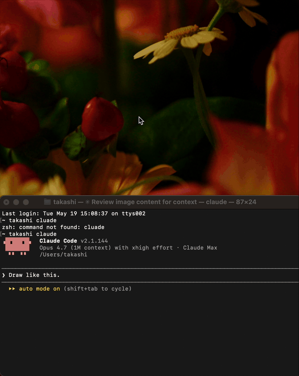

# AIPeek

> A lightweight macOS sketch app for handing quick mouse-drawn sketches off to AI chat tools — Claude Code, Claude.ai, Discord — in one paste.

[](LICENSE)


[](CONTRIBUTING.md)

<p align="center">
  
</p>

## Why AIPeek

Sometimes you just want to show an AI a quick sketch — *"is this UI right?"*, *"look at this layout idea"*, *"the wireframe I have in mind is roughly this"*. The usual path is friction-heavy: open a screenshot tool, draw on a canvas, save, find the file, drag into chat, repeat for every iteration.

AIPeek collapses that loop:

1. **Open AIPeek** and sketch with the mouse.
2. The sketch **auto-saves** and is **kept on the clipboard**.
3. **Paste** into Claude Code, Claude.ai, Discord, or anywhere else.
4. Keep editing — the clipboard stays current, so *"look again, I updated it"* just works.

Built for Apple Silicon Macs running macOS 14 (Sonoma) or newer. Mac Catalyst + SwiftUI + PencilKit under the hood.

## Features

- **Auto-save** (default ON) — every drawing is saved under a stable session filename, 1-second debounced. No "did I save?" anxiety.
- **Auto-clipboard** (default ON) — saved drawings are pushed to the clipboard as a JPEG **+** file-path pair. Paste once into Claude Code; afterwards *"look again"* always reads the latest version.
- **Shift snap** — hold Shift while dragging to lock the stroke to a horizontal or vertical line. The cursor turns into a crosshair while held.
- **Red marker** — a separate vermilion ink that renders *under* black strokes (z-order trick), so you can annotate over your sketch without covering the original.
- **Manual Copy** — one click to push the current canvas to the clipboard, for when auto-copy is off or you want an immediate push.
- **Light-mode export** — drawings are rasterised in a forced light trait collection, so the exported JPEG is always black-on-cream even when the system is in dark mode.
- **Undo / Redo** — `⌘Z` / `⌘⇧Z`, with stroke-granularity history.

## Installation

### Pre-built binary (recommended)

1. Download the latest `AIPeek-vX.Y.Z.zip` from the [Releases](https://github.com/TakashiHamada/aipeek/releases) page.
2. Unzip and drag `AIPeek.app` into `/Applications/` (or `~/Applications/`).
3. **First launch**: right-click on `AIPeek.app` → **Open** → confirm. The app is signed for local distribution only, not Apple-notarised, so Gatekeeper will warn the first time.

> [!TIP]
> If Releases is empty, see the [Build from source](#build-from-source) section below — `xcodebuild` is one command.

### Build from source

Requirements:

- Xcode 16 or newer
- macOS 14 (Sonoma) or newer
- Apple Silicon Mac (also builds for Intel Macs but is only tested on Apple Silicon)

```sh
git clone https://github.com/TakashiHamada/aipeek.git
cd aipeek

xcodebuild -project Sketch.xcodeproj -scheme Sketch \
  -configuration Release \
  -destination 'platform=macOS,variant=Mac Catalyst' build
```

The built `.app` lands under:

```
~/Library/Developer/Xcode/DerivedData/Sketch-*/Build/Products/Release-maccatalyst/AIPeek.app
```

Copy that into `/Applications/` (or `~/Applications/`) and launch.

## Usage

1. **Launch** AIPeek.
2. **Sketch** with the mouse — Pen (P), Red Marker (R), or Eraser (E).
3. The drawing **auto-saves** and lands on the **clipboard**.
4. **Paste** into Claude Code / Claude.ai / Discord / etc.
5. Keep editing — the clipboard tracks the latest state.

### Keyboard shortcuts

| Key | Action |
| --- | --- |
| **P** | Pen (black monoline, width 3) |
| **R** | Red marker (vermilion, width 14) |
| **E** | Eraser |
| **H** | Help overlay |
| **⌘N** | New canvas (clears and reserves a new filename when auto-save is on) |
| **⌘S** | Copy — push image + path to clipboard (disabled while auto-copy is active) |
| **⌘,** | Preferences |
| **⌘Z** / **⌘⇧Z** | Undo / Redo |
| **Shift + drag** | Constrain stroke to a horizontal or vertical straight line |

## Storage

```
~/Library/Application Support/com.giftten.aipeek/
├── config.json
└── sessions/
    └── YYYY-MM-DD/
        └── sketch_HH-MM-SS.jpg
```

JPEGs are written at quality `0.9` — visually lossless for line sketches, while keeping file sizes small.

## Configuration

`config.json` lives next to the `sessions/` folder. You can edit it by hand, but the easier route is the in-app Preferences window (`⌘,`) — changes apply live and persist immediately.

```json
{
  "autoSave": true,
  "autoCopyOnSave": true,
  "retentionDays": 1,
  "customSessionsRoot": null
}
```

| Key | Default | Description |
| --- | --- | --- |
| `autoSave` | `true` | 1-second debounce after each drag, then save to disk and push the path to the clipboard |
| `autoCopyOnSave` | `true` | Push the JPEG image itself (not just the path) to the clipboard on each save |
| `retentionDays` | `1` | At launch, keep this many recent session folders. `-1` = keep all. `0` = delete all. `N ≥ 1` = keep the last *N* days |
| `customSessionsRoot` | `null` | Override the sessions folder location. `null` = default path. `~` is expanded |

## Architecture (brief)

```
Sketch/
├── SketchApp.swift          # @main + menu commands
├── ContentView.swift        # ZStack: canvas + toolbar + overlays
├── Canvas/                  # PencilKit-backed drawing
│   ├── CanvasView.swift           # UIViewRepresentable + stroke z-order
│   ├── CanvasController.swift     # @MainActor, auto-save / tool switch
│   └── LoggingCanvasView.swift    # PKCanvasView subclass; Shift snap, hit-test based PencilKit suppression
├── Config/                  # Codable AppConfig + ObservableObject AppSettings
├── Export/                  # PKDrawing → JPEG, file store, clipboard writer
├── Support/                 # Catalyst title-bar tuning
└── UI/                      # Help / About / Preferences / Toast / Theme
```

A lot of the canvas behaviour is shaped by non-obvious PencilKit and Mac Catalyst quirks. If you're hacking on the canvas (Shift-snap, undo, the red-marker underlay, etc.), please skim [`CLAUDE.md`](CLAUDE.md) first — it documents the design decisions and the traps you'll re-discover otherwise.

> _`CLAUDE.md` is currently in Japanese; an English translation PR is welcome._

## Contributing

Issues and pull requests are very welcome — AIPeek is in active development. Before opening a non-trivial PR, please file an issue so we can talk about scope and direction.

Start here: [`CONTRIBUTING.md`](CONTRIBUTING.md).

## License

AIPeek is released under the [MIT License](LICENSE).

## Acknowledgments

- Built on Apple's [PencilKit](https://developer.apple.com/documentation/pencilkit), [SwiftUI](https://developer.apple.com/xcode/swiftui/), and [Mac Catalyst](https://developer.apple.com/mac-catalyst/).
- Designed with [Claude Code](https://www.anthropic.com/claude-code) and [Claude.ai](https://claude.ai) workflows in mind.
- Development assisted by Anthropic's Claude.
